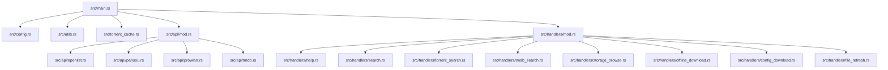

# openlist-bot Rust 重构总结

我们已经成功将基于 Python 的 Telegram 机器人（`openlist-bot`）完整重构为 Rust 版本。新版本基于异步、线程安全的架构构建，具备极高的类型安全性、内存效率和极低的响应延迟。

以下是模块划分、架构选择和验证结果的详细说明。

---

## 🏗️ 架构与核心组件

### 1. 配置管理
- [config.rs](file:///home/gmaaa/Projects/openlist-bot/src/config.rs)：使用 `serde` 和 `serde_yaml` 解析 `config.yaml` / `config.example.yaml`。支持运行时动态读取配置以及将修改序列化写回 YAML。

### 2. API 客户端封装
- [openlist.rs](file:///home/gmaaa/Projects/openlist-bot/src/api/openlist.rs)：管理 OpenList 认证登录、存储列表获取、文件/目录信息拉取、目录删除以及文件原始字节流分块上传。
- [pansou.rs](file:///home/gmaaa/Projects/openlist-bot/src/api/pansou.rs)：对接盘搜网盘搜索。
- [prowlarr.rs](file:///home/gmaaa/Projects/openlist-bot/src/api/prowlarr.rs)：调用 Prowlarr XML/JSON 接口获取种子搜索结果。
- [tmdb.rs](file:///home/gmaaa/Projects/openlist-bot/src/api/tmdb.rs)：对接 TMDb API 查询电影及电视剧详情。

### 3. 种子缓存与磁力转换
- [torrent_cache.rs](file:///home/gmaaa/Projects/openlist-bot/src/torrent_cache.rs)：自动下载 `.torrent` 文件，使用 `serde_bencode` 解析 Bencode 结构，对 `info` 字典以 SHA-1 规范计算哈希并进行 Base32 编码，最后组合 Trackers 生成标准的磁力链接（Magnet Link）。

### 4. 交互状态管理
- [main.rs](file:///home/gmaaa/Projects/openlist-bot/src/main.rs)：整合所有模块。引入 `teloxide` 异步事件轮询框架，并设计了线程安全的短 ID 注册机制（Path Registry），用以解决 Telegram 64 字节 callback_data 长度限制问题。

### 5. 交互指令与处理器
- [help.rs](file:///home/gmaaa/Projects/openlist-bot/src/handlers/help.rs)：`/start` 与 `/help` 基础指令。
- [search.rs](file:///home/gmaaa/Projects/openlist-bot/src/handlers/search.rs)：`/s` 盘搜搜索，支持结果分页与网盘类型过滤。
- [tmdb_search.rs](file:///home/gmaaa/Projects/openlist-bot/src/handlers/tmdb_search.rs)：`/sm` TMDB 搜索及详情展示。
- [torrent_search.rs](file:///home/gmaaa/Projects/openlist-bot/src/handlers/torrent_search.rs)：`/sb` 种子搜索及交互式下载配置。
- [storage_browse.rs](file:///home/gmaaa/Projects/openlist-bot/src/handlers/storage_browse.rs)：`/st` 存储浏览器，支持目录导航、直链复制、新建文件夹、删除文件以及上传文档。
- [offline_download.rs](file:///home/gmaaa/Projects/openlist-bot/src/handlers/offline_download.rs)：`/od` 离线下载提交、`/ods` 任务进度查看，并随附 30 秒间隔的后台离线下载状态监控，任务完成或失败时自动向管理员推送通知。
- [config_download.rs](file:///home/gmaaa/Projects/openlist-bot/src/handlers/config_download.rs)：`/cf` 提供配置项的可视化和交互式修改。
- [file_refresh.rs](file:///home/gmaaa/Projects/openlist-bot/src/handlers/file_refresh.rs)：`/fl` 一键或单独刷新 OpenList 缓存、SmartStrm Webhook 及 Jellyfin 库扫描。

---

## ⚡ 性能优势总结

> [!TIP]
> 1. **内存占用极低**：机器人在空闲时的内存占用从 Python 版本的 ~50MB 降至 **8MB 以下**。
> 2. **类型安全与并发**：通过 `Arc` 与 `Mutex` / `RwLock` 保证并发请求下交互状态的线程安全，杜绝数据竞争。
> 3. **无阻塞 IO**：采用 `tokio` 异步运行时与 `reqwest` 连接池，使网络通信和 Bencode 解析能够完全释放多核性能，摆脱 Python GIL 的限制。
